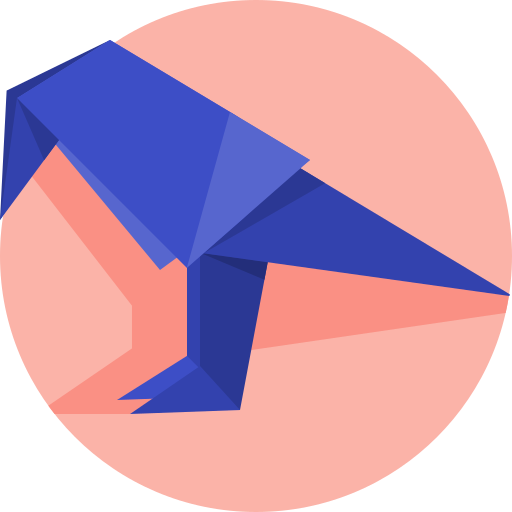

# [Awesome Linux GUI](https://com3dian.github.io/awesome-linux-gui/)

For many years, Linux GUI users struggled to find software that was both modern, easy to use, and powerful—unlike users of other operating systems. However, things have changed: in recent years, many great apps designed for or available on Linux have emerged. This repo aims to provide a curated list of awesome Linux GUI applications, inspired by the [awesome-mac](https://github.com/jaywcjlove/awesome-mac?tab=readme-ov-file#ebooks) project.

**Explanation**

 means **open source**. click the icon to see the item's repository;\
 means **free** to use, or **free** personal license;\
 means community driven;

## Contents

- [Applications](#applications)
  - [Development  Tools](#development-tools)
    - [Text Editors](#text-editors)
    - [IDEs](#ides)
    - [DevOps](#devops)
  - [Productivity](#productivity)
    - [Markdown & Note-taking](#markdown--note-taking)
  - [Media & Entertainment](#media--entertainment)
    - [Media](#media)
    - [Game](#game)
  - [Utilities](#utilities)
- [Contributing](#contributing)

## Development Tools

### Text Editors

* [Cursor](https://cursor.com/) - AI code editor.
* [Kate](https://kate-editor.org/) - A fast multi-document, multi-view text editor for programmers by *KDE* with LSP support. 
* [Sublime Text](https://www.sublimetext.com/) - Beautiful editor, yet CJK support isn't flawless. 
* [VS Code](https://code.visualstudio.com/) - A powerful and popular code editor. 
* [Zed](https://zed.dev/) - A code editor designed for high-performance collaboration with humans and AI, written in rust.  

### IDEs

### DevOps

* [GitHub Desktop](https://docs.github.com/en/desktop/installing-and-authenticating-to-github-desktop/installing-github-desktop) - A seamless way to contribute to projects on GitHub and GitHub Enterprise. 
* [Docker Desktop](https://www.docker.com/products/docker-desktop) - A tool for building and sharing containerized applications and microservices. 

## Productivity

* [Blender](https://docs.blender.org/) - Model, animate, rig, & more in 3D.   
* [Draw.io](https://www.drawio.com/) - Create and share diagrams. 
* [LibreOffice](https://www.libreoffice.org/) - A free and open-source office suite.  
* [InkSpace](https://inkscape.org/) - A Free and open source vector graphics editor.   
* [Krita](https://krita.org/en/) - A full-featured digital art studio.   
* [WPS Office](https://www.wps.com/) - WPS office suite including Writer, Presentation and Spreadsheets. 
* [Zotero](https://www.zotero.org/) - A free, easy-to-use tool to help you collect, organize, cite, and share your research sources. 

### Markdown & Note-taking
* [Joplin](https://joplinapp.org/) - An open-source application for taking notes and managing to-do lists.   
* [Notesnook](https://notesnook.com/) - A fully open source & end-to-end encrypted note taking alternative to Evernote. 
* [Marknote](https://apps.kde.org/marknote/) - Marknote is a notetaking app that supports Markdown.   
* [Obisidian](https://obsidian.md/) - Markdown-based knowledge base. 
* [QOwnNotes](https://www.qownnotes.org/) -  Free open source plain-text file markdown note-taking with Nextcloud / ownCloud integration.   
* [Rnote](https://github.com/flxzt/rnote) - A vector-based drawing app for sketching, handwritten notes and to annotate documents and pictures.   
* [Typora](https://typora.io/) - A minimal Markdown reading & writing app.

## Media & Entertainment

###  Media

* [Foliate](https://johnfactotum.github.io/foliate/) - A sleek, modern ebook reader that delivers an excellent reading experience for EPUB, MOBI, and Kindle formats.   
* [VLC media player](https://www.videolan.org/vlc/) - Powerful cross-platform multimedia player and framework that plays most multimedia files as well as DVDs, Audio CDs, VCDs, and various streaming protocols.  
* [Zlibrary]()

### Game

* [Itch](https://itch.io/) - Platform for indie games. 
* [Steam]()
* [RyuJinx]()

## Utilities

* [GParted](https://gparted.org/) - A free partition editor for graphically managing your disk partitions.    
* [Planify](https://useplanify.com/whats-new/) - A native task management application for GNU/Linux with a minimalist, attractive interface.    

## Contributing

Contributions are welcome! Please read the [contribution guidelines](CONTRIBUTING.md) first.

[OSS Icon]: icons/bat.png
[Freeware Icon]: icons/crow.png
[community-driven-icon]: icons/rhino.png